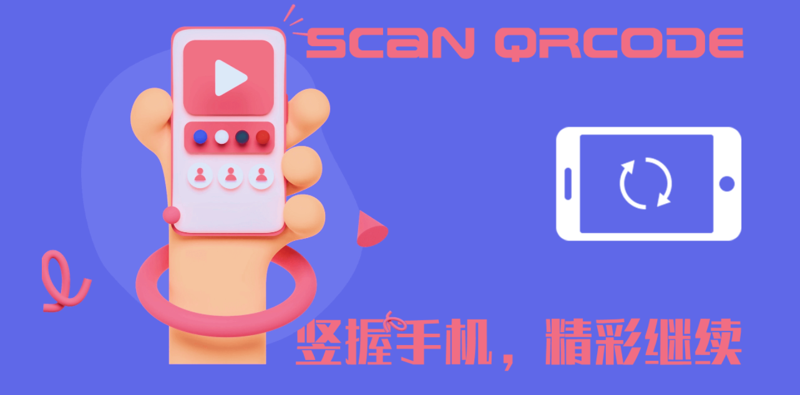
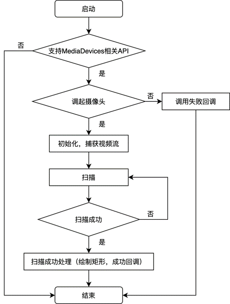
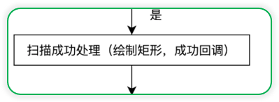
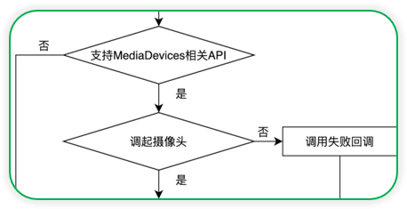
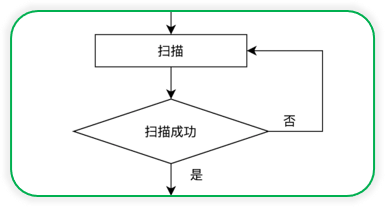
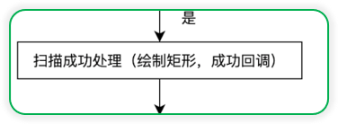
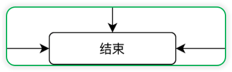
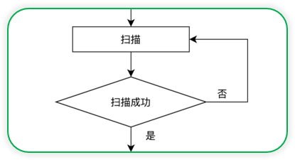
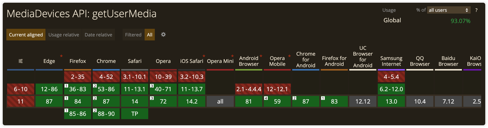

# 前端实现H5浏览器扫码功能


背景介绍、实现效果、技术简介、代码实现、总结等5部分组成

## 背景

云盘有邀请成员加入云盘功能，成员可以通过管理员提供的企业二维码加入云盘。
移动客户端APP已经实现成员扫码加入云盘的功能，现在云盘H5也需要对标APP，实现用户扫码加入云盘功能。

## 实现效果

用户在申请加入云盘的页面进行如下操作：
选择二维码加入方式
获取浏览器访问摄像头权限
扫码识别
跳转进入申请页面


> 在线体验：https://dragonir.github.io/h5-scan-qrcode/#/



横屏检测：[《五十音小游戏中的前端知识》](https://juejin.cn/post/6987393152332070920)

## 技术简介

### WebRTC API

**WebRTC** (Web Real-Time Communications) 是一项实时通讯技术，它允许网络应用或者站点，在不借助中间媒介的情况下，建立浏览器之间点对点（Peer-to-Peer）的连接，实现视频流和（或）音频流或者其他任意数据的传输。WebRTC包含的这些标准使用户在无需安装任何插件或者第三方的软件的情况下，创建点对点（Peer-to-Peer）的数据分享和电话会议成为可能。

**三个主要接口**：
* MediaStream：能够通过设备的摄像头及话筒获得视频、音频的同步流
* RTCPeerConnection：是WebRTC用于构建点对点之间稳定、高效的流传输的组件
* RTCDataChannel：使得浏览器之间建立一个高吞吐量、低延时的信道，用于传输任意数据

> https://developer.mozilla.org/zh-CN/docs/Web/API/WebRTC_API

### WebRTC adapter

虽然 WebRTC 规范已经相对健全稳固了，但是并不是所有的浏览器都实现了它所有的功能，有些浏览器需要在一些或者所有的 WebRTC API上添加前缀才能正常使用。

WebRTC 组织在github上提供了一个 WebRTC适配器（WebRTC adapter）来解决在不同浏览器上实现 WebRTC 的兼容性问题。这个适配器是一个JavaScript垫片，它可以让你根据 WebRTC 规范描述的那样去写代码，在所有支持 WebRTC的浏览器中不用去写前缀或者其他兼容性解决方法。

> https://developer.mozilla.org/en-US/docs/Web/API/WebRTC_API/adapter.js


### 核心的API：navigator.mediaDevices.getUserMedia

网页调用摄像头需要调用 getUserMedia API，MediaDevices.getUserMedia() 会提示用户给予使用媒体输入的许可，媒体输入会产生一个MediaStream，里面包含了请求的媒体类型的轨道。此流可以包含一个视频轨道（来自硬件或者虚拟视频源，比如相机、视频采集设备和屏幕共享服务等等）、一个音频轨道（同样来自硬件或虚拟音频源，比如麦克风、A/D转换器等等），也可能是其它轨道类型。

它返回一个 Promise 对象，成功后会resolve回调一个 MediaStream 对象；若用户拒绝了使用权限，或者需要的媒体源不可用，promise会reject回调一个 PermissionDeniedError 或者 NotFoundError 。(返回的promise对象可能既不会resolve也不会reject，因为用户不是必须选择允许或拒绝。)

通常可以使用 navigator.mediaDevices 来获取 MediaDevices ，例如：

```js
navigator.mediaDevices.getUserMedia(constraints)
  .then(function(stream) {
    // 使用这个stream
  })
  .catch(function(err) {
    // 处理error
  })
```

>https://developer.mozilla.org/zh-CN/docs/Web/API/MediaDevices/getUserMedia


### 二维码解析库：JSQR

jsQR 是一个纯 JavaScript 二维码解析库，该库读取原始图像或者是摄像头，并将定位，提取和解析其中的任何QR码。

如果要使用jsQR扫描网络摄像头流，则需要ImageData从视频流中提取，然后可以将其传递给jsQR。

jsQR 导出一个方法，该方法接受4个参数，分别是解码的图像数据，宽、高以及可选的对象进一步配置扫描行为。

imageData：格式为 [r0, g0, b0, a0, r1, g1, b1, a1, ...] 的 Uint8ClampedArray（ 8位无符号整型固定数组） 的rgba像素值。

```js
const code = jsQR(imageData, width, height, options);
if (code) {
  console.log('找到二维码！', code);
}
```

> https://github.com/cozmo/jsQR


## 代码实现

### 流程

整个扫码流程如图所示：
页面初始化，先检查浏览器是否支持mediaDevices相关API，浏览器进行调去摄像头，调用失败，就执行失败回调；调用成功，进行捕获视频流，然后进行扫码识别，没有扫瞄到可识别的二维码就继续扫描，扫码成功后绘制扫描成功图案并进行成功回调。



### 页面结构

企业云盘h5项目是vue技术栈，我们先看下页面结构

* 提示框
* 扫码框
* video：展示摄像头捕获视频流
* canvas: 绘制视频帧，用于二维码识别

```html
<template>
  <div class="scaner" ref="scaner">
    <div class="banner" v-if="showBanner">
      <i class="close_icon" @click="() => showBanner = false"></i>
      <p class="text">若当前浏览器无法扫码，请切换其他浏览器尝试</p>
    </div>
    <div class="cover">
      <p class="line"></p>
      <span class="square top left"></span>
      <span class="square top right"></span>
      <span class="square bottom right"></span>
      <span class="square bottom left"></span>
      <p class="tips">将二维码放入框内，即可自动扫描</p>
    </div>
    <video
      v-show="showPlay"
      class="source"
      ref="video"
      :width="videoWH.width"
      :height="videoWH.height"
      controls
    ></video>
    <canvas v-show="!showPlay" ref="canvas" />
    <button v-show="showPlay" @click="run">开始</button>
  </div>
</template>
```

### 方法：绘制

* 画线
* 画框
（用于扫码成功后绘制矩形图形



```js
// 画线
    drawLine (begin, end) {
      this.canvas.beginPath();
      this.canvas.moveTo(begin.x, begin.y);
      this.canvas.lineTo(end.x, end.y);
      this.canvas.lineWidth = this.lineWidth;
      this.canvas.strokeStyle = this.lineColor;
      this.canvas.stroke();
    },
    // 画框
    drawBox (location) {
      if (this.drawOnfound) {
        this.drawLine(location.topLeftCorner, location.topRightCorner);
        this.drawLine(location.topRightCorner, location.bottomRightCorner);
        this.drawLine(location.bottomRightCorner, location.bottomLeftCorner);
        this.drawLine(location.bottomLeftCorner, location.topLeftCorner);
      }
    },
```

### 方法：初始化
* 检查是否支持
* 调起摄像头
* 成功失败处理



```js
    // 初始化
    setup () {
      if (this.responsive) {
        this.$nextTick(() => {
          this.containerWidth = this.$refs.scaner.clientWidth;
        });
      }
      if (navigator.mediaDevices && navigator.mediaDevices.getUserMedia) {
        this.previousCode = null;
        this.parity = 0;
        this.active = true;
        this.canvas = this.$refs.canvas.getContext("2d");
        const facingMode = this.useBackCamera ? { exact: 'environment' } : 'user';
        const handleSuccess = stream => {
           if (this.$refs.video.srcObject !== undefined) {
            this.$refs.video.srcObject = stream;
          } else if (window.videoEl.mozSrcObject !== undefined) {
            this.$refs.video.mozSrcObject = stream;
          } else if (window.URL.createObjectURL) {
            this.$refs.video.src = window.URL.createObjectURL(stream);
          } else if (window.webkitURL) {
            this.$refs.video.src = window.webkitURL.createObjectURL(stream);
          } else {
            this.$refs.video.src = stream;
          }
          this.$refs.video.playsInline = true;
          const playPromise = this.$refs.video.play();
          playPromise.catch(() => (this.showPlay = true));
          playPromise.then(this.run);
        };
        navigator.mediaDevices
          .getUserMedia({ video: { facingMode } })
          .then(handleSuccess)
          .catch(() => {
            navigator.mediaDevices
              .getUserMedia({ video: true })
              .then(handleSuccess)
              .catch(error => {
                this.$emit("error-captured", error);
              });
          });
      }
    },
```

### 方法：周期性扫描


### 方法：成功回调


### 方法：停止


```js
 run () {
      if (this.active) {
        requestAnimationFrame(this.tick);
      }
    },
    found (code) {
      if (this.previousCode !== code) {
        this.previousCode = code;
      } else if (this.previousCode === code) {
        this.parity += 1;
      }
      if (this.parity > 2) {
        this.active = this.stopOnScanned ? false : true;
        this.parity = 0;
        this.$emit("code-scanned", code);
      }
    },
    // 完全停止
    fullStop () {
      if (this.$refs.video && this.$refs.video.srcObject) {
        this.$refs.video.srcObject.getTracks().forEach(t => t.stop());
      }
    }
```

### 方法：扫描


```js
tick () {
      if (this.$refs.video && this.$refs.video.readyState === this.$refs.video.HAVE_ENOUGH_DATA) {
        this.$refs.canvas.height = this.videoWH.height;
        this.$refs.canvas.width = this.videoWH.width;
        this.canvas.drawImage(this.$refs.video, 0, 0, this.$refs.canvas.width, this.$refs.canvas.height);
        const imageData = this.canvas.getImageData(0, 0, this.$refs.canvas.width, this.$refs.canvas.height);
        let code = false;
        try {
          code = jsQR(imageData.data, imageData.width, imageData.height);
        } catch (e) {
          console.error(e);
        }
        if (code) {
          this.drawBox(code.location);
          this.found(code.data);
        }
      }
      this.run();
    },
```

### 父组件页面

```html
<template>
  <div class="scan">
    <div class="nav">
      <a class="close" @click="() => $router.go(-1)"></a>
      <p class="title">Scan QRcode</p>
    </div>
    <div class="scroll-container">
      <Scaner
        v-on:code-scanned="codeScanned"
        v-on:error-captured="errorCaptured"
        :stop-on-scanned="true"
        :draw-on-found="true"
        :responsive="false"
      />
    </div>
  </div>
</template>
```


### 父组件方法

```js
import Scaner from '../components/Scaner';

export default {
  name: 'Scan',
  components: {
    Scaner
  },
  data () {
    return {
      errorMessage: "",
      scanned: ""
    }
  },
  methods: {
    codeScanned(code) {
      this.scanned = code;
      setTimeout(() => {
        alert(`扫码解析成功: ${code}`);
      }, 200)
    },
    errorCaptured(error) {
      switch (error.name) {
        case "NotAllowedError":
          this.errorMessage = "Camera permission denied.";
          break;
        case "NotFoundError":
          this.errorMessage = "There is no connected camera.";
          break;
        case "NotSupportedError":
          this.errorMessage =
            "Seems like this page is served in non-secure context.";
          break;
        case "NotReadableError":
          this.errorMessage =
            "Couldn't access your camera. Is it already in use?";
          break;
        case "OverconstrainedError":
          this.errorMessage = "Constraints don't match any installed camera.";
          break;
        default:
          this.errorMessage = "UNKNOWN ERROR: " + error.message;
      }
      console.error(this.errorMessage);
     alert('相机调用失败');
    }
  },
  mounted () {
    var str = navigator.userAgent.toLowerCase(); 
    var ver = str.match(/cpu iphone os (.*?) like mac os/);
    if (ver && ver[1].replace(/_/g,".") < '10.3.3') {
     alert('相机调用失败');
    }
  }
```

### 完整代码

> https://github.com/dragonir/h5-scan-qrcode


## 总结

### 兼容性

* 即使使用了adapter，getUserMedia API在部分浏览器中也存在不支持的
* 低版本浏览器（如 iOS 10.3以下）、Android小众浏览器（如 IQOO自带浏览器）不兼容
* QQ、微信内置浏览器无法调用



### 推荐阅读

[1]. Taking still photos with WebRTC
https://developer.mozilla.org/zh-CN/docs/Web/API/WebRTC_API/Taking_still_photos

[2]. 如何使用JavaScript访问设备前后摄像头
https://juejin.cn/post/6844904184643321870

[3]. Choosing cameras in JavaScript with the mediaDevices API
https://www.twilio.com/blog/2018/04/choosing-cameras-javascript-mediadevices-api.html

